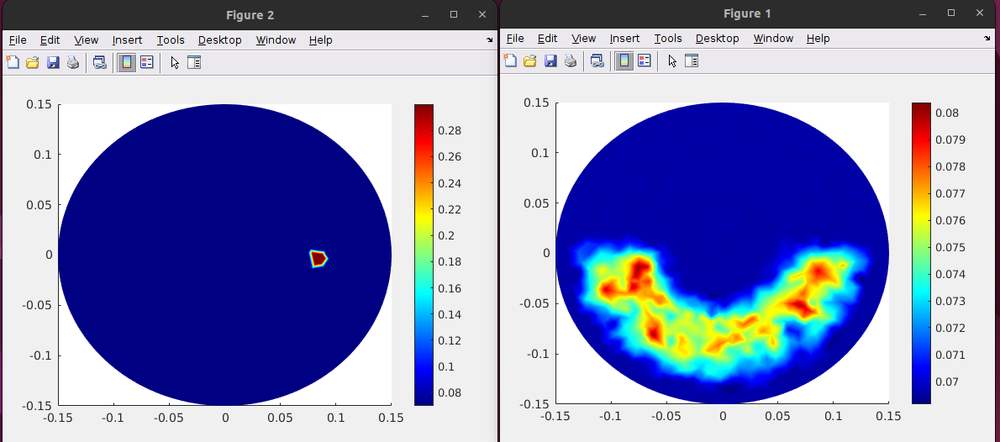

# Medical Bodies
- Taking in circular meshes (medical bodies), getting voltage data from the electrodes, and simulating the medical body back using AI/ML techniques with the voltages. Aka the sig_data_coarse values.

- Combines physical modeling and machine learning to solve an inverse imaging problem.

# Results

**NOTE:** This model as you can see is 

# Data gathering
1) Run MATLAB
2) Run ML_EIT.m
3) Run e1_t1_e1_save.mat

Then we transform the data into csv format for python:

4) Open terminal and use these two commands to turn the .mat files into .csv files: 
```
cd scripts/
python3 sig_data_mat_To_CSV.py --input data/sig_data_course.mat
python3 voltage_data_mat_to_CSV.py --input data/voltage_data.mat  
```

5) Then the data is ready for you to train with!

# How to run the training/predictions
1) Create a conda environment
```
conda env create -f environment.yml
```
2) Change directory into Scripts
```
cd scripts/
```
3) Training/Prediction

This will train from the csv inside of the dataset csv files
```
python3 trainModel.py --input dataset/voltageDataset.csv --output dataset/datasetTrainSigData.csv --model_path data/model1.pth
```

This will do an evaluation by loading the model and placing it in evaluation mode
```
python3 predictModel.py --input dataset/voltageDataset.csv --output predictions/sig_data_predict.mat --model model.pth
```

4) Validate the predicted run and visualize it using the MATLAB code **predictedexrun.m** file.

# Plot the circle mesh (course)
figure;pdemesh(p, e, t)

# Plot the circle mesh (fine)
figure;pdemesh(p1, e1, t1)
